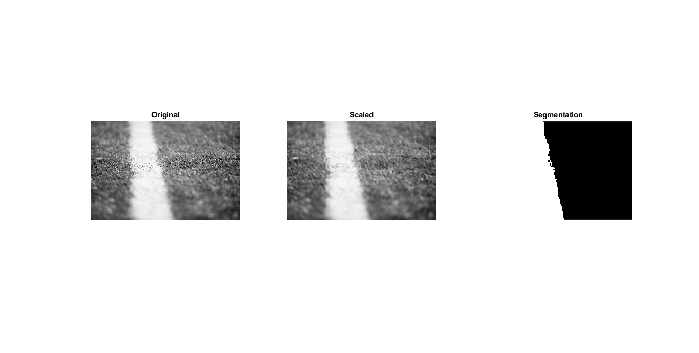

# Image cut segmentation algorithm

Seperating a image into two parts, bu using ncut algorithm. The algorithm is stated in this ![www.imageprocessingplace.com]book. 

## Screencapture

## Prerequisites

MATLAB 2018a

## Authors

* **Håkon Gimse**

